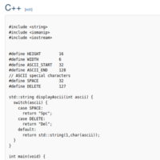

## Welcome to my Portfolio

I'm an undergraduate Bachelor Engineering Software student. 

## Skills & Interests 

I am a huge fan of C++ and am learning about web development based on React and Typescript. Other proficient languages include: 
- Java 
- Python 
- Perl 

My interests cover: 
- Algorithms
- Scripting 

## Projects

My work over the years.

### Current 

Here are projects that I am actively working on. 

|Project | Description | Languages |
| :-- | :-- | :-- |
| [Rosetta Code Contributions](https://github.com/Moop204/rosetta-code-contributions)   | Monthly contributions to Rosetta Code in languages that I am very familiar with. | C++ |

|Project | Description | Languages |Project | Description | Languages |
| :-- | :-- | :-- | :-- | :-- | :-- |
| [Rosetta Code Contributions](https://github.com/Moop204/rosetta-code-contributions)   | Monthly contributions to Rosetta Code in languages that I am very familiar with. | C++ | [Rosetta Code Contributions](https://github.com/Moop204/rosetta-code-contributions)   | Monthly contributions to Rosetta Code in languages that I am very familiar with. | C++ |

### Completed

Here are projects that are at their final complete stage. 

